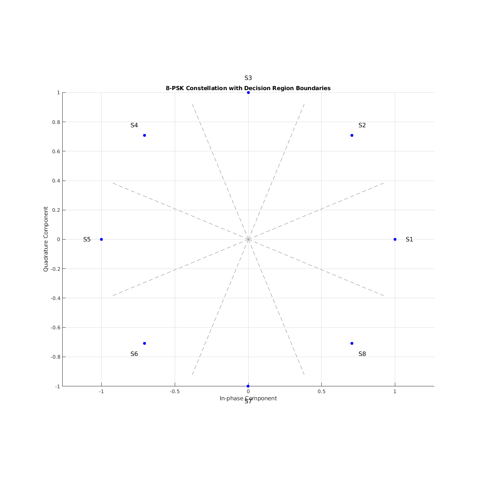
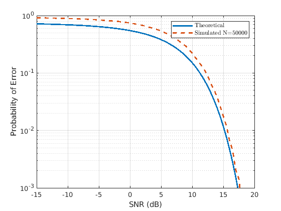
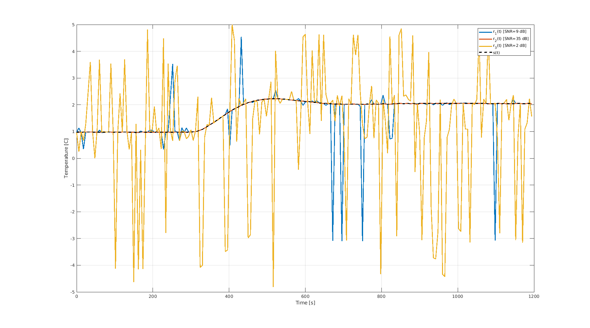
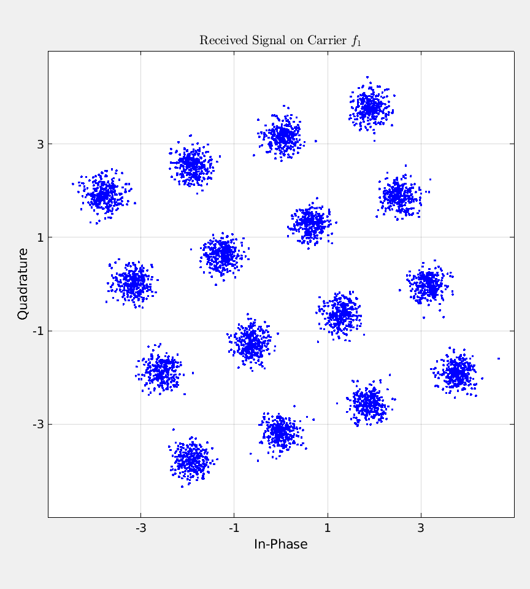
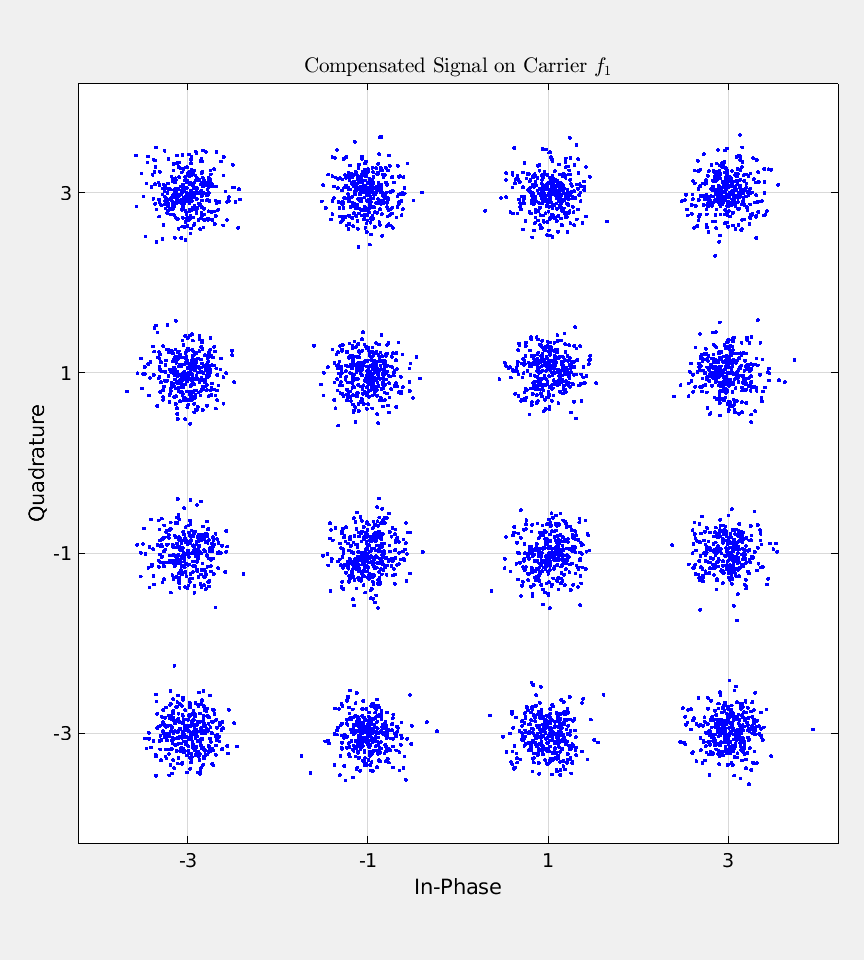
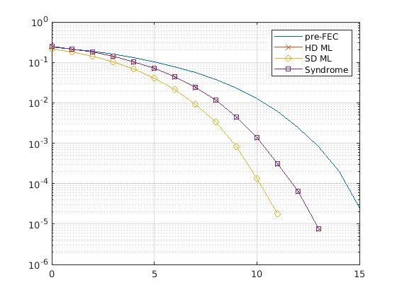

# Communication Theory (5ETB0), TU/e

Assignments for the Communication Theory course (course code 5ETB0) in the Electrical
Engineering programme at Eindhoven University of Technology (TU/e), 2024-2025. The three
assignments build a digital communication receiver in MATLAB: signal geometry and
detection, matched filtering with real received data, quadrature multiplexing, and
forward error correction. Each assignment folder holds the MATLAB code, the generated
figures, and the submitted report PDF.

## Assignment 1: modulation and detection

Constellation design and error analysis for passband modulation. The work maps bit
patterns onto 8-PSK symbols under both natural binary and Gray encoding, draws the
decision regions, and studies 16-QAM error performance. For 16-QAM the probability of
symbol error is derived analytically (a Q-function union bound) and then estimated by
Monte Carlo simulation with a maximum-likelihood detector, comparing the two over an SNR
sweep. Increasing the number of simulated symbols tightens the estimate onto the
theoretical curve.

Code: `SimulatePe16QAM.m` (simulation loop), `Pe16QAM.m` (theoretical error), and
`mlDecision16QAM.m` (nearest-symbol detector). The 8-PSK constellation and encoding plots
are generated by the Python scripts in the same folder.

## Assignment 2: matched filter receiver over a real channel

An On-Off Keying (OOK) link recovering temperature readings from three received waveforms
at different signal-to-noise ratios. The chain is built from Gram-Schmidt
orthogonalization and signal-energy considerations, then implemented as an OOK modulator,
a matched filter receiver that filters and samples at the symbol instants, and a
threshold demodulator. The recovered bits are checked with bit error rate and estimated
SNR, and each frame is unpacked (preamble, data, postamble) with a two's complement data
field to reconstruct the temperature signal. The plot shows the decoded readings against
the true signal for the three channels, with the high-SNR channel tracking it closely and
the low-SNR channel breaking down.

Code: `OOKModulation.m`, `MFReceiver.m`, `OOKDemodulation.m`, `OOKBitErrorRate.m`,
`EstimateSNR.m`, `GetTempReadings.m`, driven by `A2_Simulator.m` on `A2_Dataset.mat`.

## Assignment 3: quadrature multiplexing and error correction

Two problems. The first demultiplexes a 16-QAM signal carried on two carriers: each
carrier is down-converted with in-phase and quadrature references, matched filtered, and
sampled. The signal on the second carrier arrives with an I/Q imbalance from a delay,
which is corrected with a rotation matrix before detection. The scatter plots show the
received constellation rotated by the imbalance, then squared up after compensation.

The second problem is forward error correction with the (7,4) Hamming code. The encoder is
built from the generator matrix, and the received symbols are decoded three ways:
maximum-likelihood hard decision, maximum-likelihood soft decision, and syndrome decoding.
The bit error rates are compared against the uncoded case over an SNR sweep, showing the
coding gain and that soft-decision ML performs best.

Code: `A3Q1_Simulator.m`, `QAMDemuxReceiver.m`, `CompQAMImbalance.m`, `mlDecision16QAM.m`
for problem 1; `A3Q2_Simulator.m`, `encodeHamming.m`, `decodeML_HD.m`, `decodeML_SD.m`,
`decodeSyndrome.m`, `calculateErrors.m` for problem 2.

## Topics

- Signal space, Gram-Schmidt orthogonalization, signal energy
- 4-PAM, 8-PSK, and 16-QAM modulation
- Gray versus natural binary mapping and decision regions
- Maximum-likelihood detection
- Probability of symbol error: union bound and Monte Carlo estimation
- On-Off Keying, matched filter receivers, threshold demodulation
- Bit error rate and SNR estimation
- Frame decoding with two's complement data fields
- Quadrature multiplexing and I/Q imbalance compensation
- (7,4) Hamming coding with hard-decision, soft-decision, and syndrome decoding

## Running

Open the assignment folder in MATLAB and run the `*_Simulator.m` script; it loads the
provided `.mat` dataset and calls the accompanying functions. Assignment 1 also includes
Python scripts (NumPy and Matplotlib) for the 8-PSK constellation and encoding figures.

## Technologies

MATLAB, Communications and Signal Processing routines, Python (NumPy, Matplotlib).
